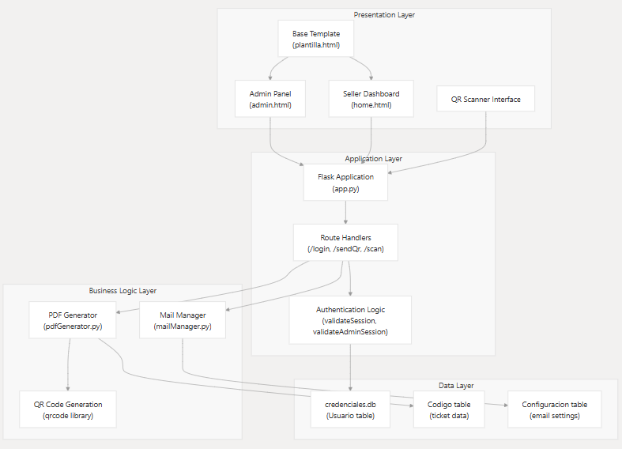
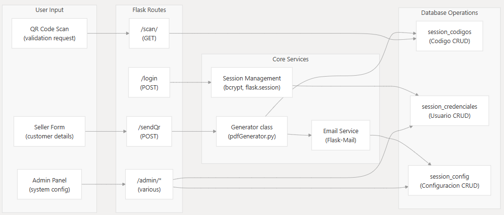
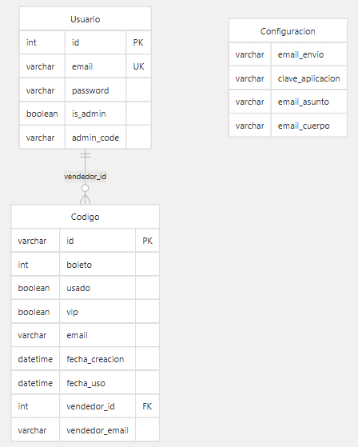

<h1 align="center">🎟️ TicketMagQr</h1>

<p align="center">
  
</p>

<p align="center">
  
  
  
</p>

**TicketMagQr** es una plataforma integral de gestión de entradas basada en la web, diseñada para organizadores de eventos que necesitan generar, distribuir y validar boletos utilizando **códigos QR**.  
El sistema ofrece control de acceso basado en roles, con interfaces separadas para vendedores y administradores, permitiendo la venta segura de boletos, la distribución automatizada por correo electrónico y la validación en tiempo real mediante el escaneo de códigos QR.

-----

## 📋 Descripción

TicketMagQr es una aplicación web completa para la gestión de boletos de eventos con códigos QR. Permite generar, enviar y validar boletos digitales de manera eficiente, con soporte para diferentes tipos de boletos (normal y VIP) y un sistema completo de administración.  
`app.py:5`

-----

## ✨ Características Principales

### 🎫 Gestión de Boletos

  - Generación automática de códigos QR únicos para cada boleto  
  - Soporte para boletos VIP y normales con diferentes privilegios  
  - Envío automático por correo electrónico con PDF adjunto  
  - Validación en tiempo real mediante escaneo QR  
      `app.py:108-147` `app.py:150-216`

### 👤 Sistema de Usuarios

  - Autenticación segura con contraseñas hasheadas  
  - Roles diferenciados: usuarios normales y administradores  
  - Sesiones persistentes con tiempo de expiración configurable  
      `database.py:36-51` `app.py:219-244`

### 🔧 Panel de Administración

  - Gestión completa de usuarios (crear, editar, eliminar)  
  - Control total de boletos generados  
  - Configuración de email personalizable  
  - Exportación de datos a Excel  
  - Estadísticas en tiempo real  
      `app.py:252-276` `app.py:359-423`

### 📱 Escáner QR Integrado

  - Interfaz web para escaneo de códigos QR  
  - Validación instantánea del estado del boleto  
  - Historial de escaneos recientes  
      `app.py:449-460`

-----

## 🏗️ Arquitectura del Sistema

El sistema sigue una arquitectura de aplicación web tradicional con separación entre:

  - **Presentación**: Plantillas HTML renderizadas con Jinja2.  
  - **Lógica de negocio**: Controladores y validaciones en Flask.  
  - **Datos**: Persistencia en base de datos SQL.  

### 📌 Diagrama General
<p align="center">
  
</p>
-----

## 🔄 Componentes Clave y Flujo de Datos

El flujo de datos principal se centra en la **generación y validación de boletos**:

1.  El vendedor autentica su sesión.  
2.  Se ingresan los datos del cliente.  
3.  Se genera un QR único y un PDF personalizado.  
4.  El sistema envía automáticamente el ticket por correo.  
5.  En el evento, logística escanea el QR.  
6.  El sistema valida el estado del boleto y marca su uso.  

### 📌 Diagrama de Flujo
<p align="center">
  
</p>
-----

## ⚙️ Pila Tecnológica y Dependencias

| Componente              | Tecnología        | Propósito |
|--------------------------|------------------|-----------|
| **Framework Web**        | Flask            | Manejo de solicitudes HTTP, rutas y sesiones |
| **Base de Datos**        | SQLite           | Persistencia de usuarios, boletos y configuración |
| **ORM**                  | SQLAlchemy       | Abstracción y gestión de BD |
| **Autenticación**        | bcrypt           | Hashing y verificación de contraseñas |
| **Generación de PDF**    | ReportLab        | Creación de tickets con QR en PDF |
| **Generación de QR**     | qrcode           | Códigos QR únicos por ticket |
| **Correo Electrónico**   | Flask-Mail (SMTP)| Envío de boletos por correo |
| **Motor de Plantillas**  | Jinja2           | Renderizado de vistas HTML |

-----

## 🗄️ Esquema de Base de Datos

El sistema maneja tres tablas principales:

1.  **Usuarios** → credenciales, roles (admin, vendedor).  
2.  **Tickets** → información del cliente, tipo de entrada, estado.  
3.  **Configuración** → ajustes globales del sistema.  

### 📌 Diagrama de BD
<p align="center">
  
</p>
-----

## 🔑 Flujos de Trabajo Principales

### 🎫 Flujo de Venta de Entradas

1.  El vendedor inicia sesión (`/login`) → `app.py [219-244]`  
2.  Ingresa datos del cliente en el panel → `templates/home.html [62-108]`  
3.  Se genera el QR y el PDF → `pdf_generator.py [23-52]`  
4.  El sistema envía el ticket al correo → `sendMessage() en app.py [141]`  

-----

### ✅ Flujo de Validación de Tickets

1.  Logística escanea el código QR → `/scan/<qr>` en `app.py [150-216]`  
2.  Se consulta en la base de datos el estado del ticket.  
3.  El sistema responde si el boleto es válido o inválido.  
4.  Se marca el ticket como **usado** para evitar fraudes.  

-----

### 🛠️ Gestión Administrativa

  - Inicio de sesión con credenciales especiales → `app.py [233-240]`  
  - Gestión de usuarios → `/admin/create_user`, `/admin/update_user` → `app.py [252-279]`  
  - Configuración global del sistema → `/admin/update_config` → `app.py [318-356]`  
  - Exportación de datos → `/admin/export_users`, `/admin/export_codes` → `app.py [359-423]`  

-----

## 🚀 Instalación y Configuración

### 🔧 Prerrequisitos

  - **Python 3.7+**
  - **pip** (gestor de paquetes de Python)

### 1\. Clonar el Repositorio

```bash
git clone https://github.com/Jlrg09/TicketMagQr.git
cd TicketMagQr
```

### 2\. Instalar Dependencias

```bash
pip install -r requirements.txt
```

### 3\. Configuración de Variables de Entorno

Crea un archivo `.env` en la raíz del proyecto con la siguiente configuración:
`app.py:28-47`

```bash
SECRET_KEY=tu_clave_secreta_aqui
MAIL_USERNAME=tu_email@gmail.com
MAIL_PASSWORD=tu_contraseña_de_aplicacion_gmail
```

### 4\. Crear Usuario Administrador

```bash
python create_admin.py
```

`create_admin.py:4-6`

Credenciales por defecto:

  - Email: `administrador@systeplus.com`
  - Contraseña: `administrador`
  - Código admin: `123456`

### 5\. Ejecutar la Aplicación

```bash
python app.py
```

La aplicación estará disponible en:
`http://localhost:5000`
`app.py:680`

-----

## 📧 Configuración de Email

### Gmail

  - Habilita la verificación en 2 pasos.
  - Genera una **contraseña de aplicación**.
  - Usa esa contraseña en la variable `MAIL_PASSWORD` del archivo `.env`.

### Configuración Dinámica

El sistema permite configurar el email desde el panel de administración, sobrescribiendo las variables de entorno.
`database.py:53-68`

-----

## 💻 Uso del Sistema

### Para Vendedores

  - **Login**: Ingresa con tu email y contraseña.
  - **Generar Boletos**: Especifica cantidad, tipo (normal/VIP) y email del cliente.
  - **Envío Automático**: El sistema genera el PDF y lo envía por email.

### Para Administradores

  - **Login Admin**: Usa credenciales + código de administrador.
  - **Gestión de Usuarios**: Crea, edita y elimina vendedores.
  - **Control de Boletos**: Ve, edita y elimina boletos generados.
  - **Configuración**: Personaliza emails y parámetros del sistema.
  - **Exportación**: Descarga datos en formato Excel.

### Para Control de Acceso

  - **Escanear QR**: Usa la cámara web desde la ruta `/qr-scanner`.
  - **Validación Automática**: El sistema verifica el estado del boleto.
  - **Marcar como Usado**: Los boletos se marcan automáticamente al ser escaneados.
    `app.py:150-216`

-----

## 🗄️ Base de Datos

El sistema utiliza tres bases de datos SQLite separadas:

1.  `codigos.db`
      - Tabla `Codigos`: Almacena información de boletos generados.
        `database.py:24-34`
2.  `credenciales.db`
      - Tabla `Usuarios`: Gestiona la autenticación y los roles.
        `database.py:36-42`
3.  `config.db`
      - Tabla `Configuracion`: Almacena parámetros de email y mensajes.
        `database.py:53-60`

-----

## 🔧 API Endpoints

### Autenticación

  - `POST /login` - Iniciar sesión
  - `GET /logout` - Cerrar sesión

### Boletos

  - `POST /sendQr` - Generar y enviar boletos
  - `GET /scan/<qr>` - Validar código QR
  - `GET /ticket-stats` - Estadísticas de boletos
  - `GET /recent-tickets` - Boletos recientes

### Administración

  - `POST /admin/create_user` - Crear usuario
  - `GET /admin/get_users` - Listar usuarios
  - `POST /admin/update_user` - Actualizar usuario
  - `POST /admin/delete_user` - Eliminar usuario
  - `GET /admin/export_users` - Exportar usuarios a Excel
  - `GET /admin/export_codes` - Exportar códigos a Excel
    `app.py:108-147`

-----

## 🔒 Seguridad

  - Contraseñas hasheadas con **bcrypt**.
  - Validación de sesiones en todas las rutas protegidas.
  - Roles diferenciados con validación de permisos.
  - Normalización de emails a minúsculas para consistencia.
    `app.py:51-55` `database.py:44-46`

-----

## 📱 Características Avanzadas

### Generación de PDFs

El sistema genera PDFs personalizados con códigos QR integrados y numeración secuencial.
`pdfGenerator.py:23-52`

### Gestión de Email

Envío automático de boletos con configuración personalizable de asunto y cuerpo del mensaje.
`mailManager.py:7-46`

-----

## 🐛 Solución de Problemas

### Error de Base de Datos

Si encuentras errores de base de datos, ejecuta el siguiente script:

```bash
python migrardb.py
```

### Problemas de Email

  - Verifica las credenciales en el archivo `.env`.
  - Asegúrate de usar una **contraseña de aplicación** (no la contraseña normal de Gmail).
  - Revisa la configuración desde el panel de administración.

### Permisos de Archivos

Asegúrate de que la aplicación tenga permisos para crear la carpeta `qrs/` y los archivos PDF.

-----

## 📄 Licencia

Este proyecto está licenciado bajo la **Licencia Propietaria TicketMagQr**.  
- Uso gratuito permitido únicamente para fines no comerciales (educativos, comunitarios, benéficos).  
- Uso comercial, reventa o distribución con fines de lucro requieren autorización expresa del autor.  

Consulta el archivo [LICENSE](./LICENSE) para más detalles.

-----

## 🤝 Contribución

Las contribuciones son bienvenidas. Por favor, sigue estos pasos:

1.  Haz un *fork* del proyecto.
2.  Crea una rama para tu nueva funcionalidad (`git checkout -b feature/AmazingFeature`).
3.  Confirma tus cambios (`git commit -m 'Add some AmazingFeature'`).
4.  Sube la rama a tu repositorio (`git push origin feature/AmazingFeature`).
5.  Abre un *Pull Request*.

-----

## 📬 Contacto

  - **Autor**: José Luis Romero González
  - **Correo**: joseromerolg@unimagdalena.edu.co
  - **GitHub**: @jlrg09

-----

## 📞 Soporte

Para soporte técnico o consultas, contacta a devpumation@gmail.com.

Desarrollado con ❤️ para la gestión eficiente de eventos.


<h1 align="center">🎟️ TicketMagQr</h1>

<p align="center">
  
</p>

<p align="center">
  
  
  
</p>

**TicketMagQr** es una plataforma integral de gestión de entradas basada en la web, diseñada para organizadores de eventos que necesitan generar, distribuir y validar boletos utilizando **códigos QR**.  
El sistema ofrece control de acceso basado en roles, con interfaces separadas para vendedores y administradores, permitiendo la venta segura de boletos, la distribución automatizada por correo electrónico y la validación en tiempo real mediante el escaneo de códigos QR.

-----

## 📋 Descripción

TicketMagQr es una aplicación web completa para la gestión de boletos de eventos con códigos QR. Permite generar, enviar y validar boletos digitales de manera eficiente, con soporte para diferentes tipos de boletos (normal y VIP) y un sistema completo de administración.  
`app.py:5`

-----

## ✨ Características Principales

### 🎫 Gestión de Boletos

  - Generación automática de códigos QR únicos para cada boleto  
  - Soporte para boletos VIP y normales con diferentes privilegios  
  - Envío automático por correo electrónico con PDF adjunto  
  - Validación en tiempo real mediante escaneo QR  
      `app.py:108-147` `app.py:150-216`

### 👤 Sistema de Usuarios

  - Autenticación segura con contraseñas hasheadas  
  - Roles diferenciados: usuarios normales y administradores  
  - Sesiones persistentes con tiempo de expiración configurable  
      `database.py:36-51` `app.py:219-244`

### 🔧 Panel de Administración

  - Gestión completa de usuarios (crear, editar, eliminar)  
  - Control total de boletos generados  
  - Configuración de email personalizable  
  - Exportación de datos a Excel  
  - Estadísticas en tiempo real  
      `app.py:252-276` `app.py:359-423`

### 📱 Escáner QR Integrado

  - Interfaz web para escaneo de códigos QR  
  - Validación instantánea del estado del boleto  
  - Historial de escaneos recientes  
      `app.py:449-460`

-----

## 🏗️ Arquitectura del Sistema

El sistema sigue una arquitectura de aplicación web tradicional con separación entre:

  - **Presentación**: Plantillas HTML renderizadas con Jinja2.  
  - **Lógica de negocio**: Controladores y validaciones en Flask.  
  - **Datos**: Persistencia en base de datos SQL.  

### 📌 Diagrama General
<p align="center">
  
</p>
-----

## 🔄 Componentes Clave y Flujo de Datos

El flujo de datos principal se centra en la **generación y validación de boletos**:

1.  El vendedor autentica su sesión.  
2.  Se ingresan los datos del cliente.  
3.  Se genera un QR único y un PDF personalizado.  
4.  El sistema envía automáticamente el ticket por correo.  
5.  En el evento, logística escanea el QR.  
6.  El sistema valida el estado del boleto y marca su uso.  

### 📌 Diagrama de Flujo
<p align="center">
  
</p>
-----

## ⚙️ Pila Tecnológica y Dependencias

| Componente              | Tecnología        | Propósito |
|--------------------------|------------------|-----------|
| **Framework Web**        | Flask            | Manejo de solicitudes HTTP, rutas y sesiones |
| **Base de Datos**        | SQLite           | Persistencia de usuarios, boletos y configuración |
| **ORM**                  | SQLAlchemy       | Abstracción y gestión de BD |
| **Autenticación**        | bcrypt           | Hashing y verificación de contraseñas |
| **Generación de PDF**    | ReportLab        | Creación de tickets con QR en PDF |
| **Generación de QR**     | qrcode           | Códigos QR únicos por ticket |
| **Correo Electrónico**   | Flask-Mail (SMTP)| Envío de boletos por correo |
| **Motor de Plantillas**  | Jinja2           | Renderizado de vistas HTML |

-----

## 🗄️ Esquema de Base de Datos

El sistema maneja tres tablas principales:

1.  **Usuarios** → credenciales, roles (admin, vendedor).  
2.  **Tickets** → información del cliente, tipo de entrada, estado.  
3.  **Configuración** → ajustes globales del sistema.  

### 📌 Diagrama de BD
<p align="center">
  
</p>
-----

## 🔑 Flujos de Trabajo Principales

### 🎫 Flujo de Venta de Entradas

1.  El vendedor inicia sesión (`/login`) → `app.py [219-244]`  
2.  Ingresa datos del cliente en el panel → `templates/home.html [62-108]`  
3.  Se genera el QR y el PDF → `pdf_generator.py [23-52]`  
4.  El sistema envía el ticket al correo → `sendMessage() en app.py [141]`  

-----

### ✅ Flujo de Validación de Tickets

1.  Logística escanea el código QR → `/scan/<qr>` en `app.py [150-216]`  
2.  Se consulta en la base de datos el estado del ticket.  
3.  El sistema responde si el boleto es válido o inválido.  
4.  Se marca el ticket como **usado** para evitar fraudes.  

-----

### 🛠️ Gestión Administrativa

  - Inicio de sesión con credenciales especiales → `app.py [233-240]`  
  - Gestión de usuarios → `/admin/create_user`, `/admin/update_user` → `app.py [252-279]`  
  - Configuración global del sistema → `/admin/update_config` → `app.py [318-356]`  
  - Exportación de datos → `/admin/export_users`, `/admin/export_codes` → `app.py [359-423]`  

-----

## 🚀 Instalación y Configuración

### 🔧 Prerrequisitos

  - **Python 3.7+**
  - **pip** (gestor de paquetes de Python)

### 1\. Clonar el Repositorio

```bash
git clone https://github.com/Jlrg09/TicketMagQr.git
cd TicketMagQr
```

### 2\. Instalar Dependencias

```bash
pip install -r requirements.txt
```

### 3\. Configuración de Variables de Entorno

Crea un archivo `.env` en la raíz del proyecto con la siguiente configuración:
`app.py:28-47`

```bash
SECRET_KEY=tu_clave_secreta_aqui
MAIL_USERNAME=tu_email@gmail.com
MAIL_PASSWORD=tu_contraseña_de_aplicacion_gmail
```

### 4\. Crear Usuario Administrador

```bash
python create_admin.py
```

`create_admin.py:4-6`

Credenciales por defecto:

  - Email: `administrador@systeplus.com`
  - Contraseña: `administrador`
  - Código admin: `123456`

### 5\. Ejecutar la Aplicación

```bash
python app.py
```

La aplicación estará disponible en:
`http://localhost:5000`
`app.py:680`

-----

## 📧 Configuración de Email

### Gmail

  - Habilita la verificación en 2 pasos.
  - Genera una **contraseña de aplicación**.
  - Usa esa contraseña en la variable `MAIL_PASSWORD` del archivo `.env`.

### Configuración Dinámica

El sistema permite configurar el email desde el panel de administración, sobrescribiendo las variables de entorno.
`database.py:53-68`

-----

## 💻 Uso del Sistema

### Para Vendedores

  - **Login**: Ingresa con tu email y contraseña.
  - **Generar Boletos**: Especifica cantidad, tipo (normal/VIP) y email del cliente.
  - **Envío Automático**: El sistema genera el PDF y lo envía por email.

### Para Administradores

  - **Login Admin**: Usa credenciales + código de administrador.
  - **Gestión de Usuarios**: Crea, edita y elimina vendedores.
  - **Control de Boletos**: Ve, edita y elimina boletos generados.
  - **Configuración**: Personaliza emails y parámetros del sistema.
  - **Exportación**: Descarga datos en formato Excel.

### Para Control de Acceso

  - **Escanear QR**: Usa la cámara web desde la ruta `/qr-scanner`.
  - **Validación Automática**: El sistema verifica el estado del boleto.
  - **Marcar como Usado**: Los boletos se marcan automáticamente al ser escaneados.
    `app.py:150-216`

-----

## 🗄️ Base de Datos

El sistema utiliza tres bases de datos SQLite separadas:

1.  `codigos.db`
      - Tabla `Codigos`: Almacena información de boletos generados.
        `database.py:24-34`
2.  `credenciales.db`
      - Tabla `Usuarios`: Gestiona la autenticación y los roles.
        `database.py:36-42`
3.  `config.db`
      - Tabla `Configuracion`: Almacena parámetros de email y mensajes.
        `database.py:53-60`

-----

## 🔧 API Endpoints

### Autenticación

  - `POST /login` - Iniciar sesión
  - `GET /logout` - Cerrar sesión

### Boletos

  - `POST /sendQr` - Generar y enviar boletos
  - `GET /scan/<qr>` - Validar código QR
  - `GET /ticket-stats` - Estadísticas de boletos
  - `GET /recent-tickets` - Boletos recientes

### Administración

  - `POST /admin/create_user` - Crear usuario
  - `GET /admin/get_users` - Listar usuarios
  - `POST /admin/update_user` - Actualizar usuario
  - `POST /admin/delete_user` - Eliminar usuario
  - `GET /admin/export_users` - Exportar usuarios a Excel
  - `GET /admin/export_codes` - Exportar códigos a Excel
    `app.py:108-147`

-----

## 🔒 Seguridad

  - Contraseñas hasheadas con **bcrypt**.
  - Validación de sesiones en todas las rutas protegidas.
  - Roles diferenciados con validación de permisos.
  - Normalización de emails a minúsculas para consistencia.
    `app.py:51-55` `database.py:44-46`

-----

## 📱 Características Avanzadas

### Generación de PDFs

El sistema genera PDFs personalizados con códigos QR integrados y numeración secuencial.
`pdfGenerator.py:23-52`

### Gestión de Email

Envío automático de boletos con configuración personalizable de asunto y cuerpo del mensaje.
`mailManager.py:7-46`

-----

## 🐛 Solución de Problemas

### Error de Base de Datos

Si encuentras errores de base de datos, ejecuta el siguiente script:

```bash
python migrardb.py
```

### Problemas de Email

  - Verifica las credenciales en el archivo `.env`.
  - Asegúrate de usar una **contraseña de aplicación** (no la contraseña normal de Gmail).
  - Revisa la configuración desde el panel de administración.

### Permisos de Archivos

Asegúrate de que la aplicación tenga permisos para crear la carpeta `qrs/` y los archivos PDF.

-----

## 📄 Licencia

Este proyecto está licenciado bajo la **Licencia Propietaria TicketMagQr**.  
- Uso gratuito permitido únicamente para fines no comerciales (educativos, comunitarios, benéficos).  
- Uso comercial, reventa o distribución con fines de lucro requieren autorización expresa del autor.  

Consulta el archivo [LICENSE](./LICENSE) para más detalles.

-----

## 🤝 Contribución

Las contribuciones son bienvenidas. Por favor, sigue estos pasos:

1.  Haz un *fork* del proyecto.
2.  Crea una rama para tu nueva funcionalidad (`git checkout -b feature/AmazingFeature`).
3.  Confirma tus cambios (`git commit -m 'Add some AmazingFeature'`).
4.  Sube la rama a tu repositorio (`git push origin feature/AmazingFeature`).
5.  Abre un *Pull Request*.

-----

## 📬 Contacto

  - **Autor**: José Luis Romero González
  - **Correo**: joseromerolg@unimagdalena.edu.co
  - **GitHub**: @jlrg09

-----

## 📞 Soporte

Para soporte técnico o consultas, contacta a devpumation@gmail.com.

Desarrollado con ❤️ para la gestión eficiente de eventos.


